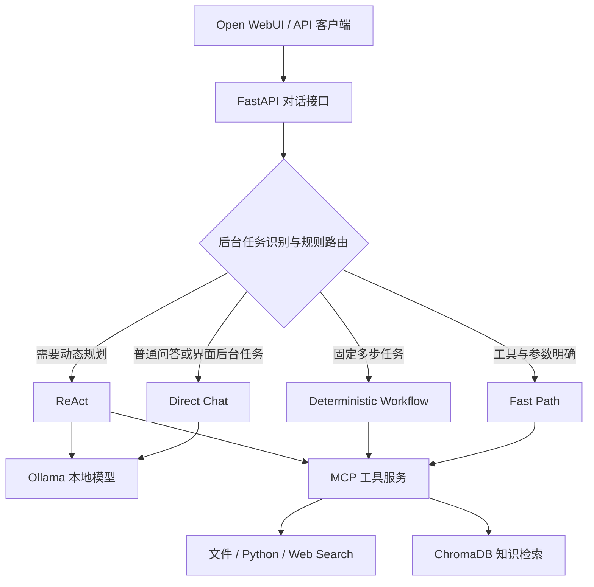

# agentLocal

**面向小模型的本地 Agent 运行时，让工具执行可控、任务结果可验证。**

agentLocal 基于 Ollama、LangChain、MCP 和 ChromaDB，提供本地问答、文件操作、Python 执行、知识库检索与仓库诊断能力。项目围绕一个具体问题展开：**在使用 3B 本地模型时，如何减少不必要的规划，让 Agent 更稳定地完成任务？**

核心方案是按任务的确定性分流：普通问答直接调用模型，明确的工具任务走 Fast Path，固定步骤由 Workflow 执行，开放任务保留 ReAct；对于代码诊断，则由运行时控制读取、测试和报告生成，模型只承担根因推理。

**已有评测记录：**路由回归 **21/21**、核心在线用例 **10/10**；在一个受控仓库诊断案例中，执行耗时由 **21.85 s 降至 5.93 s**，诊断校验由失败转为通过。结果来自仓库内的小规模评测，适用范围见下文。

[项目架构](#项目架构) · [关键实现](#关键实现) · [诊断案例](#诊断案例) · [评测结果](#评测结果) · [快速开始](#快速开始) · [当前边界与后续计划](#当前边界与后续计划)

## 项目背景

本地模型能支持低门槛的 AI 应用实验，但在接入工具后，回答质量之外还会出现执行问题：简单计算触发多轮规划、工具参数解析失败、固定流程插入无关搜索，以及模型声称任务完成却没有产生预期文件。

agentLocal 将验收目标落实到环境中的真实结果：计算是否正确，错误是否被识别，报告是否落盘，诊断是否引用真实测试输出。主要面向三类场景：

| 场景 | 使用方式 | 关注的结果 |
| --- | --- | --- |
| 本地开发辅助 | 计算、读取文件、多轮文件指代 | 工具选择和参数准确，减少多余规划 |
| 技术知识查询 | 检索本地 AI 工具文档并生成回答 | 检索内容相关，保留来源信息 |
| 小型 Python 仓库诊断 | 读取指定文件、运行测试、分析根因并生成报告 | 使用真实执行证据，报告可检查 |

## 项目架构

对话入口提供 OpenAI 风格的 `/v1/chat/completions` 接口，可连接 Open WebUI。当前路由由规则和最近对话上下文驱动；MCP Server 统一注册工具，Agent 通过其 REST 桥接接口 `/tools`、`/call` 发现和调用工具。



| 执行路径 | 决策方式 | 典型请求 |
| --- | --- | --- |
| Direct Chat | 无需工具时直接生成回答 | “解释一下时间复杂度” |
| Fast Path | 运行时构造参数并直接执行工具 | “66 乘以 7 等于多少”“读取 notes.md” |
| Deterministic Workflow | 运行时执行预定义顺序，并检查每一步结果 | “上网查一下 Python 最新版本，然后写入 python_version.md” |
| ReAct | 模型动态选择工具与后续步骤 | 需要搜索、比较、总结再保存的开放任务 |

Fast Path 省去的是模型的工具规划过程；其中知识库问答仍需要模型基于检索内容生成答案，不能将所有 Fast Path 请求都视为“零模型调用”。

**仓库诊断是独立工作流。** `run_repo_debug_workflow(...)` 接收仓库目录、测试文件、候选源码列表和报告路径，通过专门脚本调用；当前尚未接入上述聊天路由，不能将聊天入口描述为已自动支持任意仓库诊断。

## 关键实现

### 1. 根据任务确定性控制执行

系统优先识别固定工作流，再判断工具意图与参数是否明确。简单计算、文件读取等任务直接执行，避免让小模型重复生成工具规划。对于需要动态推理的任务，保留 LangChain ReAct 执行器。

工具统一设置 `return_direct=False`，由运行时决定何时结束任务：计算可以在 Fast Path 中直接返回，代码执行也能作为多步 ReAct 任务的中间步骤，避免工具提前终止整个流程。

代码入口：[路由与执行策略](https://github.com/anasappp/agentLocal/blob/main/agent/agent.py) · [工具适配器](https://github.com/anasappp/agentLocal/blob/main/agent/mcp_adapter.py)

### 2. 工具协议适配与业务错误处理

面向文本 ReAct 的单输入形式，适配器将工具参数包装为 JSON 字符串，解析后转发给工具服务，并处理非法 JSON、非对象参数和工具结果。当前接入六类工具：

| 工具 | 能力 |
| --- | --- |
| `file_list` | 列举工作目录中的文件 |
| `file_read` | 读取文本文件 |
| `file_write` | 写入文本文件 |
| `code_exec` | 在 Python 子进程中执行代码，返回输出和退出状态 |
| `web_search` | 通过 DuckDuckGo 搜索网页 |
| `query_knowledge_base` | 查询 ChromaDB，返回片段及来源 |

在“搜索后保存”工作流中，运行时同时检查 HTTP 请求和业务载荷：出现 `error` 或没有可用搜索结果时停止，不执行文件写入；写入失败则明确返回失败原因。成功的 HTTP 响应不会被直接当作任务成功。

代码入口：[工具注册与服务](https://github.com/anasappp/agentLocal/blob/main/mcp_server/server.py) · [工具实现](https://github.com/anasappp/agentLocal/tree/main/mcp_server/tools)

### 3. 多轮上下文与界面后台任务分离

API 提取最近一次用户请求，并将此前消息传入运行时。针对“再乘以 11”“再读取刚才那个文件”等表达，规则从最近消息中恢复数值或路径；普通对话也会带入历史消息。

Open WebUI 的标题、标签和追问生成请求被识别后进入 Direct Chat，减少聊天历史中的文件名、数学表达式误触发工具的情况。这里实现的是**请求内的对话上下文处理**，尚未实现独立的跨会话长期记忆服务。

代码入口：[对话接口](https://github.com/anasappp/agentLocal/blob/main/agent/main.py) · [上下文与后台任务识别](https://github.com/anasappp/agentLocal/blob/main/agent/agent.py)

### 4. 本地 RAG 与检索输入优化

知识库构建脚本配置了 13 个目标 GitHub 仓库，采集 README 与文档目录中的 Markdown，经筛选、分块和向量化后写入 ChromaDB。实际入库量取决于远端内容及抓取结果。

| 环节 | 当前实现 |
| --- | --- |
| 文档处理 | 过滤部分低价值文件；递归文本切分，块大小 500 字符、重叠 50 字符 |
| 向量化与存储 | Ollama `nomic-embed-text` + 持久化 ChromaDB |
| 查询清洗 | 去除“只使用检索结果”等回答要求，提取检索主题 |
| 查询扩展 | 对已覆盖主题使用规则扩展，例如 `GGUF` 扩展为 `GGUF model format llama.cpp` |
| 检索返回 | 默认 Top-4，保留片段内容、来源名称和 URL |

这些策略旨在减少格式要求对向量检索的干扰。当前未提供清洗、扩展前后的独立消融结果，因此不宣称检索准确率提升了某个百分比。

代码入口：[数据构建](https://github.com/anasappp/agentLocal/blob/main/scripts/ingest.py) · [向量存储](https://github.com/anasappp/agentLocal/blob/main/agent/rag.py) · [检索工具](https://github.com/anasappp/agentLocal/blob/main/mcp_server/tools/kb_search.py)

## 诊断案例

仓库包含一个可重置的 Python 演示项目：`calculator.py` 中的 `add` 本应返回两数之和，却写成了减法。

```python
def add(a: int, b: int) -> int:
    """Return the sum of two integers."""
    return a - b
```

运行测试得到 `add(7, 5) expected 12, got 2`。工作流读取指定源码与测试文件，真实执行测试，将源码和输出交给本地模型，要求返回根因文件、错误逻辑、证据与最小修复建议。运行时检查必填字段及根因文件是否属于候选源码，再生成 Markdown 报告。

验收脚本检查报告是否存在、四个章节是否齐全、根因和测试证据是否符合预期，以及 `calculator.py` 是否保持不变。测试中的 `AssertionError` 是诊断证据，工作流的成功意味着完成了正确诊断，而不是测试已经修复通过。

| 验收项 | ReAct 基线记录 | 半确定性工作流记录 |
| --- | --- | --- |
| 总体验收 | 未通过 | 通过 |
| 根因判定 | 错误指向测试文件 | 正确指向 `calculator.py` 的 `return a - b` |
| 报告存在、章节完整 | 通过 | 通过 |
| 测试证据检查 | 通过 | 通过 |
| 源码保持不变 | 通过 | 通过 |
| 执行耗时 | 21,848.45 ms | 5,926.55 ms |

两条已保存记录的耗时比约为 **3.69**，工作流耗时减少约 **72.9%**。这是同一个受控样例下两套执行方案的观察结果，执行流程与提示词均有差异，且未提供重复实验分布；不能据此推出通用提速倍数，也不能将变化全部归因于单一改动。

实现与证据：[工作流源码](https://github.com/anasappp/agentLocal/blob/main/agent/repo_debug_workflow.py) · [ReAct 原始记录](https://github.com/anasappp/agentLocal/blob/main/eval/reports/hero_demo_react_baseline.json) · [工作流原始记录](https://github.com/anasappp/agentLocal/blob/main/eval/reports/repo_debug_workflow_latest.json)

## 评测结果

评测分为路由回归、真实服务用例与受控任务验收，分别回答“是否走对执行路径”“能否返回预期结果”和“任务是否实际完成”。

| 评测层 | 覆盖内容 | 仓库保存结果 | 证据 |
| --- | --- | --- | --- |
| Router Regression | 中英文请求、四类路径、多轮指代、后台任务与负样本 | 21/21 | [路由报告](https://github.com/anasappp/agentLocal/blob/main/eval/reports/router_eval_latest.json) |
| Core Live Eval | 问答、计算、文件、多轮、错误处理、RAG | 10/10 | [在线报告](https://github.com/anasappp/agentLocal/blob/main/eval/reports/live_eval_latest.json) |
| Repo Debug | 报告、根因、真实测试证据、源码不变 | 1 个受控样例通过 | [诊断报告](https://github.com/anasappp/agentLocal/blob/main/eval/reports/repo_debug_workflow_latest.json) |

核心在线用例的延迟统计如下：

| 指标 | 数值 |
| --- | ---: |
| P50 | 429.25 ms |
| 平均值 | 1,526.11 ms |
| P95 | 7,139.41 ms |

统计口径采用评测脚本的 nearest-rank 算法。样本量为 10，因此此处 P95 对应最大延迟，来自 RAG 用例；不能作为高并发生产服务的延迟承诺。

评测结果还需结合以下条件理解：

- Core Live Eval 默认排除依赖外部搜索服务的用例，`10/10` 不包含 Web Search 的稳定性证明。
- 在线用例主要使用关键词、正则等规则判定；这适合回归检查，尚不足以评估复杂推理和回答事实一致性。
- 已保存报告未完整记录硬件、模型量化、重复次数等实验条件；本页引用历史报告，并非一次新的本机实测。
- API 的 `usage` 当前为占位值，报告中的 `tokens: 0` 不代表真实零消耗，暂不据此计算成本收益。

仓库另外提供 Pytest 测试和 GitHub Actions 配置，在 Windows / Python 3.13 环境执行单元测试及路由回归；Live Eval 和诊断评测需要本地服务及模型，未纳入当前 CI。

[评测脚本](https://github.com/anasappp/agentLocal/tree/main/eval) · [测试代码](https://github.com/anasappp/agentLocal/tree/main/tests) · [CI 配置](https://github.com/anasappp/agentLocal/blob/main/.github/workflows/ci.yml) · [Dashboard 文件](https://github.com/anasappp/agentLocal/blob/main/eval/reports/dashboard.html)

## 快速开始

### 1. 准备环境

使用 Python 3.13、Git 和已安装的 Ollama；Open WebUI 为可选界面，需要 Docker。以下命令在仓库根目录执行，以 Windows PowerShell 为例。

```powershell
git clone https://github.com/anasappp/agentLocal.git
cd agentLocal
python -m venv .venv
.\.venv\Scripts\Activate.ps1
python -m pip install -r requirements.txt
Copy-Item .env.example .env
```

macOS / Linux 的虚拟环境激活命令为 `source .venv/bin/activate`，复制配置使用 `cp .env.example .env`，其余 Python 模块命令一致。

确认 Ollama 服务已运行；如尚未启动，在独立终端运行 `ollama serve`。随后下载模型：

```powershell
ollama pull qwen2.5:3b
ollama pull nomic-embed-text
```

核心配置如下，字段名与当前代码一致；完整配置见 [`.env.example`](https://github.com/anasappp/agentLocal/blob/main/.env.example)。

```dotenv
OLLAMA_BASE_URL=http://localhost:11434
OLLAMA_MODEL=qwen2.5:3b
OLLAMA_EMBED_MODEL=nomic-embed-text
MCP_SERVER_URL=http://localhost:8001
MCP_SERVER_HOST=127.0.0.1
MCP_SERVER_PORT=8001
AGENT_API_HOST=127.0.0.1
AGENT_API_PORT=8000
CHROMA_PERSIST_DIR=.chroma
FILE_OPS_ROOT=./workspace
LOG_LEVEL=INFO
```

### 2. 启动工具服务与 Agent

在两个已激活虚拟环境的终端中依次运行，先启动 MCP 服务，再启动 Agent，以便加载工具列表。

```powershell
# 终端一
python -m mcp_server.main
```

```powershell
# 终端二
python -m agent.main
```

可通过 [MCP 健康检查](http://127.0.0.1:8001/health)、[Agent 健康检查](http://127.0.0.1:8000/health) 和 [API 文档](http://127.0.0.1:8000/docs) 查看服务。健康接口响应不等于所有工具都可用，还应完成下面的计算请求。

### 3. 发起一次工具调用

```powershell
$body = @{
    model = "local-agent"
    messages = @(
        @{ role = "user"; content = "66*7" }
    )
    stream = $false
} | ConvertTo-Json -Depth 5

$response = Invoke-RestMethod `
    -Uri "http://127.0.0.1:8000/v1/chat/completions" `
    -Method Post `
    -ContentType "application/json" `
    -Body $body

$response.choices[0].message.content
```

预期输出为 `462`。

### 4. 按需启用知识库与 Web 界面

知识库问答需要先构建索引。该步骤下载公开 GitHub 文档并调用本地 embedding 模型，需要网络连接；普通计算和文件工具不依赖这一步。

```powershell
python scripts/ingest.py
```

索引构建完成后，若 Agent / MCP 服务已经启动，重启服务再尝试“根据知识库解释一下 GGUF”。

启用 Open WebUI 时，将 `.env` 中 `AGENT_API_HOST` 改为 `0.0.0.0` 并重启 Agent，使容器可以连接宿主机服务，再运行：

```powershell
docker compose up -d
```

打开 [Open WebUI](http://localhost:3000)，选择 `local-agent`。Compose 当前只启动 WebUI，Ollama、MCP 和 Agent 仍在宿主机运行；该配置用于可信本地环境。

## 复现评测

在已激活虚拟环境的仓库根目录执行：

```powershell
# 单元测试与规则路由回归
python -m pytest -q
python -m eval.run_router_eval

# 核心真实服务用例：需要 Agent、MCP、Ollama，以及已构建的知识库
python -m eval.run_live_eval

# 可选：纳入依赖外部搜索服务的用例
python -m eval.run_live_eval --include-external

# 半确定性诊断：需要 MCP 和 Ollama，脚本会重建演示仓库
python -m eval.run_repo_debug_workflow

# 可选：通过聊天 Agent 重跑 ReAct 诊断路径
python -m eval.run_hero_demo

# 生成本地 HTML 评测看板
python -m eval.generate_dashboard
```

诊断脚本会重置 `workspace/hero_repo`，并重建 `workspace/hero_debug_report.md`；请将该目录保留给演示样例。两种诊断脚本按顺序运行，避免互相覆盖演示环境。

结果保存在 `eval/reports/`，看板为 `eval/reports/dashboard.html`，下载或在本地打开可查看。重跑 ReAct 脚本更新的是 `hero_demo_latest.*`，已保存的 `hero_demo_react_baseline.*` 是历史基线，二者需要区分。

## 代码导航

| 模块 | 职责 |
| --- | --- |
| [`agent/agent.py`](https://github.com/anasappp/agentLocal/blob/main/agent/agent.py) | 路由、Fast Path、固定工作流、ReAct、上下文和检索输入处理 |
| [`agent/main.py`](https://github.com/anasappp/agentLocal/blob/main/agent/main.py) | 对话 API、消息历史处理、响应封装 |
| [`agent/mcp_adapter.py`](https://github.com/anasappp/agentLocal/blob/main/agent/mcp_adapter.py) | 工具发现、JSON 参数解析、LangChain 工具适配 |
| [`agent/repo_debug_workflow.py`](https://github.com/anasappp/agentLocal/blob/main/agent/repo_debug_workflow.py) | 指定仓库诊断与报告生成 |
| [`mcp_server/`](https://github.com/anasappp/agentLocal/tree/main/mcp_server) | MCP 工具注册、传输与 REST 桥接、六类工具实现 |
| [`scripts/ingest.py`](https://github.com/anasappp/agentLocal/blob/main/scripts/ingest.py) | 文档采集、清洗、切分与入库 |
| [`eval/`](https://github.com/anasappp/agentLocal/tree/main/eval) | 用例、评测脚本、历史结果和 Dashboard |

**主要依赖：**Python 3.13、FastAPI、LangChain 0.3.x、Ollama、Qwen2.5 3B、MCP Python SDK、ChromaDB、nomic-embed-text、Pytest；Open WebUI 与 Docker 用于可选界面。具体版本以 [`requirements.txt`](https://github.com/anasappp/agentLocal/blob/main/requirements.txt) 为准。


