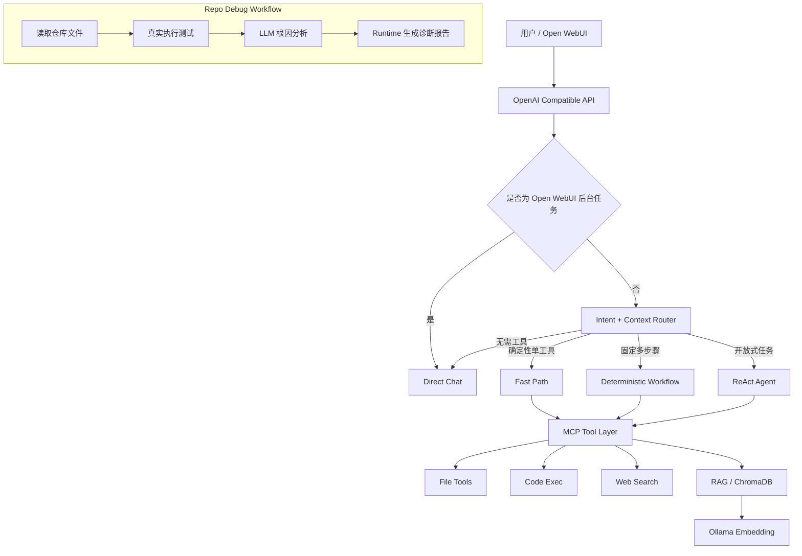

# LocalAgent Lab：面向小模型的本地智能体运行时
> 基于 Ollama + MCP + RAG + LangChain 的本地 Agent Runtime，重点解决小模型 Tool Calling 的延迟、稳定性和执行控制问题。

**状态**

- Unit Tests：22 passed
- Router Regression：21/21 passed
- Core Live Eval：10/10 passed
- Repo Debug Workflow：PASS

基于 **Ollama + MCP + RAG + LangChain** 实现的本地 AI Agent 系统。

项目重点不是单纯“接入大模型和工具”，而是解决小参数本地模型在真实 Agent 场景中的几个工程问题：

- 简单任务也走 ReAct，延迟高；
- 小模型容易重复调用工具或选错工具；
- 固定多步任务交给模型自由规划后稳定性较差；
- Tool 调用成功不等于业务执行成功；
- 模型可能声称“已经写入文件”，但实际环境中并没有文件；
- RAG 检索结果质量高度依赖 Query；
- 长链路任务中，模型同时承担规划、执行和推理，容易放大错误。

因此，本项目逐步将系统从：

```text
所有请求 → ReAct Agent
```

演进为：

```text
Direct Chat
+
Fast Path
+
Deterministic Workflow
+
ReAct
+
Semi-deterministic Workflow
```

核心设计原则是：

> **确定性的执行交给 Runtime，不确定性的推理交给 LLM。**

---

## 项目文档
~~~~
- [架构设计](docs/ARCHITECTURE.md)
- [评测结果](docs/EVALUATION.md)
- Evaluation Dashboard：`eval/reports/dashboard.html`

# 1. 项目架构



系统将请求按“执行确定性”划分为四类。

---

# 2. 四层执行策略

## 2.1 Direct Chat

对于不需要工具的普通问答，直接调用本地模型，不进入 Agent。

例如：

```text
解释一下计算机视觉是什么
什么是时间复杂度？
```

避免无意义的 Agent Planning。

---

## 2.2 Fast Path

对于能够直接确定：

```text
调用哪个 Tool
+
Tool 参数是什么
```

的任务，不再让模型生成：

```text
Thought
Action
Action Input
```

而是由 Runtime 直接执行 MCP Tool。

例如：

```text
66乘以7等于多少
读取 restart_test.md
帮我看看工作区有哪些文件
```

执行链：

```text
User
↓
Router
↓
Argument Builder
↓
MCP Tool
↓
Result
```

适用于：

- 精确计算；
- 文件读取；
- 文件写入；
- 文件列表；
- 明确 Web Search；
- 明确知识库查询。

---

## 2.3 Deterministic Workflow

对于需要多个 Tool、但执行顺序可以提前确定的任务，由 Runtime 编排。

例如：

```text
搜索 Python 最新版本，
然后把结果保存到 python_version.md
```

不需要让 ReAct 自由规划，而是：

```text
web_search
↓
结果合法性检查
↓
file_write
```

如果 Web Search 返回错误：

```json
{
  "error": "..."
}
```

Workflow 会直接终止，不再：

```text
搜索失败
→ 写空文件
→ 告诉用户“已经完成”
```

---

## 2.4 ReAct

只有无法提前确定完整执行图的开放式任务才进入 ReAct。

这样既保留 Agent 的动态规划能力，又避免所有请求都承担 ReAct 的额外延迟和解析风险。

---

# 3. Semi-deterministic Workflow

对于“执行步骤确定，但中间仍需要模型推理”的长任务，本项目进一步实现了 Semi-deterministic Workflow。

典型场景：

```text
仓库级代码问题诊断
```

执行流程：

```text
Runtime
│
├─ file_list
├─ file_read
├─ code_exec
│
▼
LLM Root Cause Reasoning
│
▼
Runtime
└─ file_write
```

其中：

```text
文件读取
测试执行
结果保存
```

由 Runtime 保证。

只有：

```text
根据代码 + 测试结果判断根因
```

交给 LLM。

这样减少小模型自由规划长链路时的无效 Tool Call 和错误传播。

---

# 4. MCP Tool Layer

目前接入的 MCP Tools：

| Tool | 功能 |
|---|---|
| `file_list` | 查看工作区文件 |
| `file_read` | 读取文件 |
| `file_write` | 写入文件 |
| `code_exec` | 执行 Python / 精确计算 |
| `web_search` | Web 搜索 |
| `query_knowledge_base` | 查询本地知识库 |

为了提高 3B 小模型的 Tool Calling 稳定性，Tool 参数协议尽量保持简单。

MCP Adapter 负责：

```text
LLM Tool Input
↓
参数解析
↓
MCP /call
↓
统一结果处理
```

减少模型直接处理复杂 Tool Schema 的压力。

---

# 5. 多轮上下文

系统支持多轮对话中的 Tool Context Recovery。

例如：

```text
用户：66乘以99等于多少？
助手：6534

用户：再乘以11
```

第二轮需要恢复：

```text
上一轮数值
+
当前操作
```

另外支持文件指代：

```text
用户：读取 restart_test.md
用户：再读取刚才那个文件
```

Runtime 会从最近上下文中恢复文件路径，而不是要求用户重新输入文件名。

---

# 6. Open WebUI 后台任务隔离

Open WebUI 会自动向模型发送：

```text
Generate title
Generate tags
Suggest follow-up questions
```

这些请求中可能包含完整聊天历史。

如果聊天历史存在：

```text
数学表达式
文件名
GGUF
Web Search
```

普通关键词 Router 可能误触发 Tool。

因此系统优先识别 Open WebUI Background Task：

```text
Open WebUI Metadata
↓
Direct Chat
```

不进入 Tool Router。

---

# 7. RAG

本地知识库基于：

```text
ChromaDB
+
nomic-embed-text
+
Ollama
```

构建。

当前成功完成：

```text
13 个 GitHub 仓库
207 个文件
5898 个 Chunks
```

知识库覆盖：

```text
Ollama
llama.cpp
LocalAI
Open WebUI
AnythingLLM
PrivateGPT
LiteLLM
GPT4All
Continue
Tabby
...
```

---

## 7.1 Retrieval Query Cleaning

用户输入：

```text
根据知识库解释一下 GGUF，
只使用检索结果里明确出现的信息
```

不会直接全部送进 Vector Search。

系统先拆出真正检索对象：

```text
GGUF
```

避免：

```text
回答格式要求
```

污染 Retrieval Query。

---

## 7.2 Query Expansion

测试发现，仅搜索：

```text
GGUF
```

容易召回：

```text
出现 GGUF 字样
```

但不一定是定义型内容。

因此加入轻量 deterministic expansion：

```text
GGUF
↓
GGUF model format llama.cpp
```

无需额外消耗一次 LLM Query Rewrite。

---

# 8. Tool Error Handling

项目中特别区分：

```text
HTTP 成功
```

和：

```text
业务成功
```

例如 MCP Server 可能返回：

```http
HTTP 200
```

但内容为：

```json
{
  "error": "202 Ratelimit"
}
```

因此 Workflow 会额外检查：

```text
if payload.get("error"):
    ...
```

而不是仅通过 HTTP Status 判断成功。

对于外部搜索失败：

```text
Search Error
↓
Workflow Stop
```

不会继续：

```text
让 LLM 根据错误信息补答案
```

降低 Hallucination 风险。

---

# 9. Repository Debugging Hero Case

项目构造了一个可重复的受控 Repo Debug Case。

代码：

```python
def add(a: int, b: int) -> int:
    """Return the sum of two integers."""
    return a - b
```

测试期望：

```text
add(7, 5) = 12
```

真实执行测试：

```text
AssertionError:
add(7, 5) expected 12, got 2
```

系统需要完成：

```text
读取仓库
↓
读取源码
↓
真实运行测试
↓
分析 Root Cause
↓
生成 debugging report
↓
保持源码不变
```

最终能够正确定位：

```text
calculator.py
```

中的：

```python
def add(a: int, b: int) -> int:
    return a - b
```

并给出建议：


```python
def add(a: int, b: int) -> int:
    return a + b
```


同时验证：

```text
calculator.py 未被自动修改
```

---

# 10. 为什么没有继续使用 Free-form ReAct

最初 Repo Debug Case 使用自由 ReAct。

实际测试过程中出现：

```text
读取文件
↓
无关 query_knowledge_base
↓
无关 web_search
↓
继续读取文件
↓
执行测试
↓
生成报告
```

虽然模型最终可能完成部分任务，但：

- Tool 调用冗余；
- 链路更长；
- 延迟更高；
- Root Cause 曾错误归因；
- 曾出现模型声称“文件已经生成”，实际文件不存在。

因此将该任务改为：

```text
Semi-deterministic Workflow
```

Runtime 负责确定步骤，LLM 只负责真正需要推理的部分。

---

# 11. 自动化评测

项目不是只通过人工聊天验证，而是建立了三层 Eval。

---

## 11.1 Router Regression Eval

测试：

- Direct；
- Fast Path；
- Workflow；
- ReAct；
- 中文 / 英文；
- 多轮上下文；
- Open WebUI Background Task；
- Router 负样本。

当前结果：

```text
21 / 21
```

即：

```text
21/21 routing regression cases passed
```

---

## 11.2 Live Agent Eval

覆盖：

- Direct Chat；
- 精确计算；
- File Tool；
- 多轮上下文；
- Error Recovery；
- RAG。

当前核心测试：

```text
10 / 10
```

本地测试环境结果：

| 指标 | 结果 |
|---|---:|
| Core Task Success | 10 / 10 |
| P50 Latency | 429.25 ms |
| Average Latency | 1526.11 ms |
| P95 Latency | 7139.41 ms |

其中 RAG 是主要长尾。

> 当前 Eval 是项目内部核心回归集，用于架构迭代验证，不代表通用 Agent Benchmark。

---

# 12. ReAct vs Workflow 对比

在同一个受控 Repo Debug Case 上：

| 架构 | Task Result | Latency |
|---|---:|---:|
| Free-form ReAct | FAIL | ≈21.8 s |
| Semi-deterministic Workflow | PASS | ≈5.9 s |

在该受控测试中，Workflow 相比自由 ReAct：

```text
约 3.69× faster
```

同时实现：

```text
Root Cause 正确
真实 Test Evidence
报告成功落盘
源码保持不变
```

这里的 3.69× 仅代表当前受控 Repo Debug Case，不作为通用 Agent 性能结论。

---

# 13. Evaluation Dashboard

项目提供本地 HTML Dashboard。

展示：

```text
Router Accuracy
Core Task Success
P50 Latency
Average Latency
P95 Latency
Category Success
Per-case Latency
Repo Debug Workflow
ReAct vs Workflow
```

生成：

```powershell
python -m eval.generate_dashboard
```

输出：

```text
eval/reports/dashboard.html
```

---

# 14. 项目目录

```text
mcp-ollama-agent/
│
├── agent/
│   ├── agent.py
│   ├── main.py
│   ├── config.py
│   ├── mcp_adapter.py
│   ├── rag.py
│   └── repo_debug_workflow.py
│
├── mcp_server/
│   ├── server.py
│   └── tools/
│
├── eval/
│   ├── cases.json
│   ├── live_cases.json
│   ├── run_router_eval.py
│   ├── run_live_eval.py
│   ├── run_hero_demo.py
│   ├── run_repo_debug_workflow.py
│   ├── generate_dashboard.py
│   └── reports/
│
├── scripts/
│   ├── ingest.py
│   ├── setup_hero_demo.py
│   └── start.ps1
│
├── tests/
├── workspace/
├── docker-compose.yml
├── requirements.txt
└── README.md
```

---

# 15. 技术栈

```text
Python 3.13
FastAPI
LangChain
Ollama
Qwen2.5 3B
MCP
ChromaDB
nomic-embed-text
Open WebUI
Docker
Pytest
```

---

# 16. 快速启动

## 16.1 创建虚拟环境

```powershell
python -m venv .venv

.\.venv\Scripts\Activate.ps1

pip install -r requirements.txt
```

---

## 16.2 Ollama 模型

```powershell
ollama pull qwen2.5:3b

ollama pull nomic-embed-text
```

---

## 16.3 环境变量

从：

```text
.env.example
```

创建：

```text
.env
```

示例：

```env
OLLAMA_BASE_URL=http://127.0.0.1:11434

OLLAMA_MODEL=qwen2.5:3b

OLLAMA_EMBED_MODEL=nomic-embed-text

MCP_HOST=0.0.0.0

MCP_PORT=8001

AGENT_HOST=0.0.0.0

AGENT_PORT=8000

CHROMA_PATH=.chroma

WORKSPACE_DIR=./workspace

LOG_LEVEL=INFO
```

敏感 Token 不提交 Git。

---

## 16.4 构建知识库

```powershell
python .\scripts\ingest.py
```

---

## 16.5 启动服务

```powershell
.\scripts\start.ps1
```

Agent：

```text
http://127.0.0.1:8000
```

MCP：

```text
http://127.0.0.1:8001
```

---

# 17. 运行评测

Router：

```powershell
python -m eval.run_router_eval
```

Live Agent：

```powershell
python -m eval.run_live_eval
```

Repo Debug：

```powershell
python -m eval.run_repo_debug_workflow
```

Dashboard：

```powershell
python -m eval.generate_dashboard
```

单元测试：

```powershell
pytest -v
```

---

# 18. 核心工程决策

## 为什么不让所有任务都走 ReAct？

因为大量请求根本不需要 Planning。

对于确定性任务，多一次 LLM Planning 意味着：

```text
更多延迟
+
更多 Token
+
Parser 风险
+
Tool Selection 风险
```

但没有增加真正的智能价值。

---

## 为什么仍然保留 ReAct？

因为部分任务的执行图无法提前确定。

因此本项目不是：

```text
去掉 Agent
```

而是：

```text
只在 Agent Planning 真正有价值时使用 Agent
```

---

## 为什么 `code_exec` 不再使用 `return_direct=True`？

项目早期为了防止小模型重复调用计算器，曾将：

```python
return_direct=True
```

绑定到 `code_exec`。

后来出现 Repo Debug 等多步任务后发现：

```text
code_exec
```

有时只是中间步骤。

如果 Tool 本身直接终止 Agent，就无法继续：

```text
code_exec
↓
file_write
```

因此最终改为：

```text
Tool
→ 负责执行

Runtime
→ 决定任务是否结束
```

简单数学通过 Fast Path 直接结束，而复杂 ReAct 可以在 `code_exec` 后继续。

---

# 19. 项目演进

项目的核心演进过程：

```text
阶段 1

Everything
→ ReAct
```

↓

```text
阶段 2

Direct
+
ReAct
```

↓

```text
阶段 3

Direct
+
Fast Path
+
ReAct
```

↓

```text
阶段 4

Direct
+
Fast Path
+
Deterministic Workflow
+
ReAct
```

↓

```text
阶段 5

Runtime-controlled Execution
+
LLM Reasoning Node
```

最终形成的设计思想：

> **不要让 LLM 控制所有步骤，而是把模型能力放在真正需要语义理解与推理的位置。**

---

# 20. 当前限制

## Web Search

当前 DuckDuckGo Provider 偶发：

```text
202 Ratelimit
```

项目已经做到：

```text
Error 正确传播
+
不写空结果
+
不让 LLM 根据失败结果编答案
```

暂未继续引入多 Search Provider。

---

## RAG Grounding

已经实现：

```text
Query Cleaning
+
Query Expansion
```

但尚未实现严格的 Claim-level Citation：

```text
回答 [1]

Sources:
[1] ...
```

---

## Token Usage

当前 OpenAI-compatible Endpoint 没有提供可靠的 Token Usage 数据，因此不将：

```text
Tokens = 0
```

解释为真实零消耗。

---

## Benchmark Scope

当前：

```text
21/21
10/10
```

属于项目内部 Regression / Core Eval。

不作为通用 Agent 能力的 100% Accuracy 宣传。

---

# 21. 项目核心结论

本项目最重要的工程结论不是：

> “给本地模型接了几个 Tool”。

而是：

> **根据任务确定性，将 Direct、Fast Path、Workflow 和 ReAct 分层；让 Runtime 控制确定执行，让 LLM 专注于真正需要推理的部分。**

这种设计在当前受控 Repo Debug Case 中，相比 Free-form ReAct：

```text
FAIL → PASS
约 21.8 s → 约 5.9 s
```

同时提高了：

```text
稳定性
可解释性
可评测性
执行边界控制
```